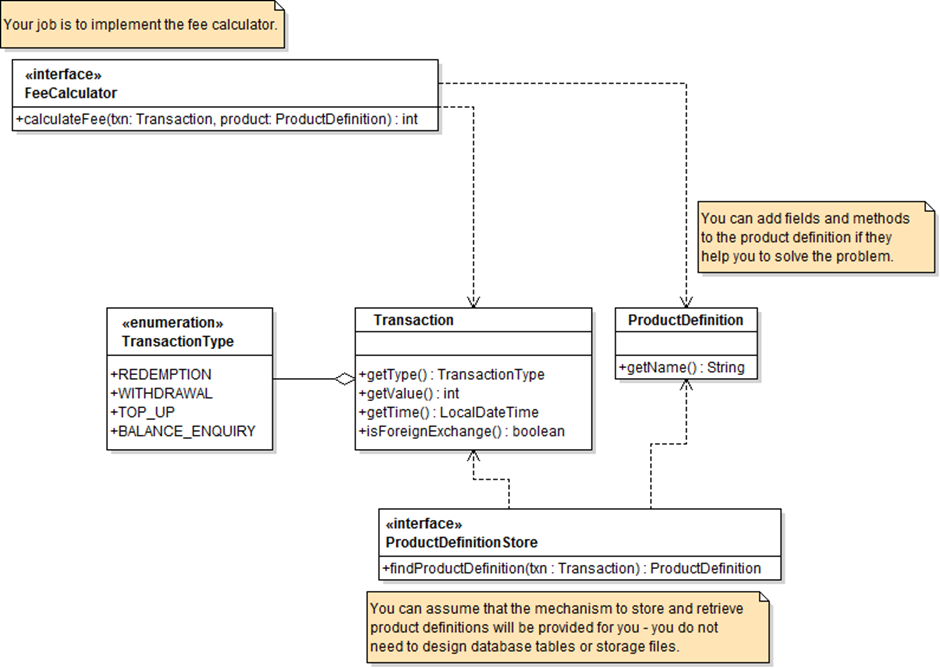

You have been asked to write a FeeCalculator component that can calculate any fees that should be applied to a transaction.
The rules about deciding whether fees are applied, and how to calculate their values can be complex:
-	Some fees are always applied, while other fees are only applied under certain circumstances.
-	Fees might be calculated as a percentage of the value of the transaction, or as a fixed value, or using some other mechanism.
     Fees will be defined as part of a product definition, and different product definitions will need to support different fees.
     Here are two sample product definitions that you need to support:
1.	THOMAS TRAVEL: apply a fixed fee of £1 to all redemption transactions, and an additional 1.5% fee if foreign exchange is involved.
2.	TISCO FINANCE: apply a fixed 5% fee to all transactions that are received after 10pm.
      In the future, other product definitions will need to be added with minimal changes to the code.
      Using the design on the next page as a starting point, detail how you might solve this problem. Pay particular attention to:
-	How different product definitions can support different kinds of fee.
-	How new kinds of fee can be added in the future, without rewriting large amounts of code.

For the implementation just run the [FeeCalculatorTest.java](src%2Ftest%2Fjava%2FFeeCalculatorTest.java) test.